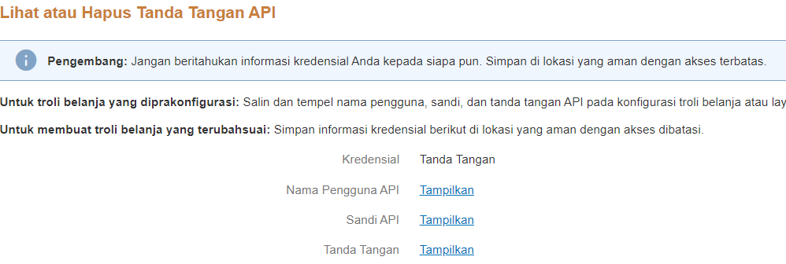

# mutasi-paypal
Library CodeIgniter / Native untuk mengambil data mutasi paypal dan proses refund (PayPal Akun Bisnis)
### PROMOSI ! Beli pulsa paypal mudah dan cepat di [napulsa.com](https://napulsa.com);

## Tutorial Mendapatkan ID dan Signature
- Silahkan daftar akun paypal bisnis terlebih dahulu [Daftar PayPal Bisnis Gratis!](https://www.paypal.com)

- Buka [Dashboard](https://www.paypal.com/mep/dashboard) anda, silahkan pilih menu Alat -> Semua Alat (Tools -> All Tools), atau Klik [Disini!](https://www.paypal.com/merchantapps/myapps);

- Pada kolom pencarian silahkan cari "API Credential", lalu klik "Buka"     
   
- Scroll ke bawah sampai anda menemukan "Integrasi NVP/SOAP API (Klasik)", lalu klik "Kelola kredensial API"   
   
- Pilih opsi "Minta Tanda Tangan API" dan klik "Setuju dan Lanjutkan"   
   
- Silahkan copy Nama Pengguna API (user) , Sandi API (pwd) , dan Tanda Tangan (signature)   
   

## Tutorial Penggunaan Library

### CodeIgniter
  Silahkan Copy Paypal.php ke directory library  
  Pemanggilan library :  
  $this->load->library('paypal', ['user' => USER, 'pwd' => PASSWORD, 'signature' => SIGNATURE]);  
  silahkan ganti menggunakan data anda  
  
  #### Cek Mutasi :
  Gunakan strtotime untuk menentukan rentang waktu dari sekarang  
  $start_date = strtotime("now"); //cek mutasi hari ini  
  $start_date = strtotime("-7days"); //cek mutasi seminggu yg lalu s/d sekarang  
  
  $cek = $this->paypal->mutasi($start_date);  
  print_r($cek);  
  
  #### Refund Pembayaran :
  $refund = $this->paypal->refund($L_TRANSACTIONID, $PAYERID, $catatan);  
  L_TRANSACTIONID dan PAYERID bisa anda dapatkan di fungsi mutasi, tambahkan catatan / note jika diperlukan  
  
 ### PHP Native
 
  define("BASEPATH", dirname(__ FILE__));  
  require("Paypal.php");  
  
  $data = array('user' => USER, 'pwd' => PASSWORD, 'signature' => SIGNATURE);  
  silahkan ganti menggunakan data anda  
  $paypal = new Paypal($data);  
  
  $start_date = strtotime("now"); //cek mutasi hari ini  
  $start_date = strtotime("-7days"); //cek mutasi seminggu yg lalu s/d sekarang  
  
  $cek = $paypal->mutasi($start_date);  
  print_r($cek);  
  
  Refund Pembayaran :  
  $refund = $paypal->refund($L_TRANSACTIONID, $PAYERID, $catatan);
  
  

